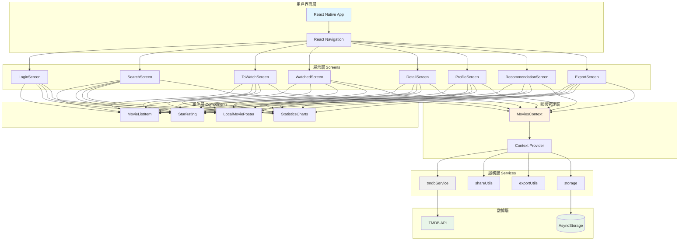
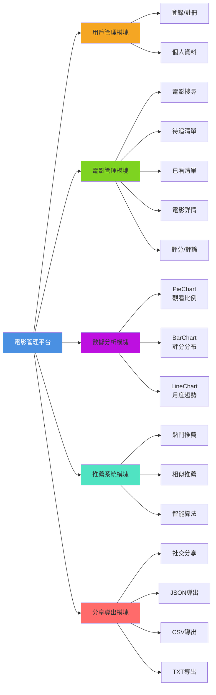
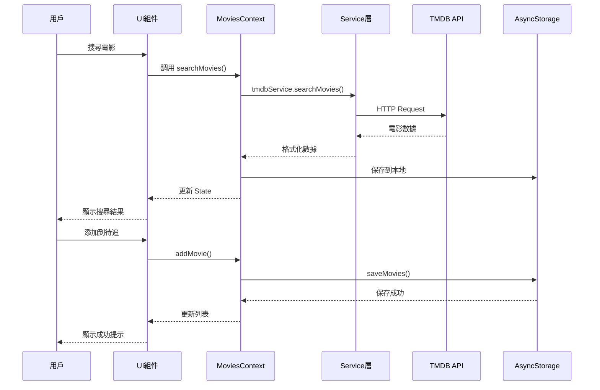
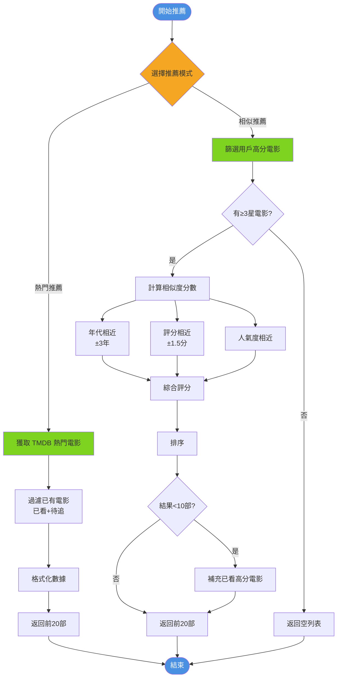
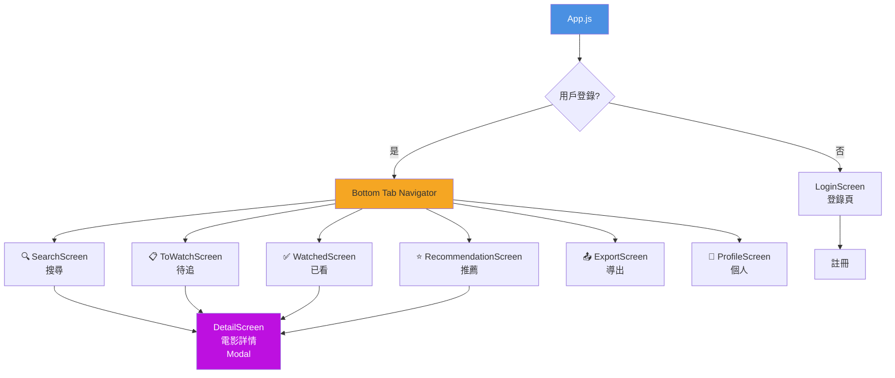
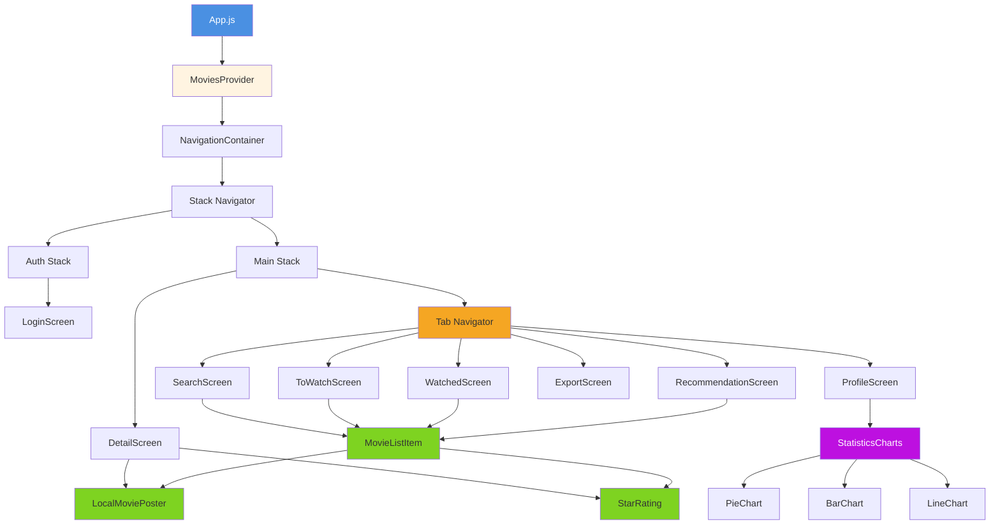
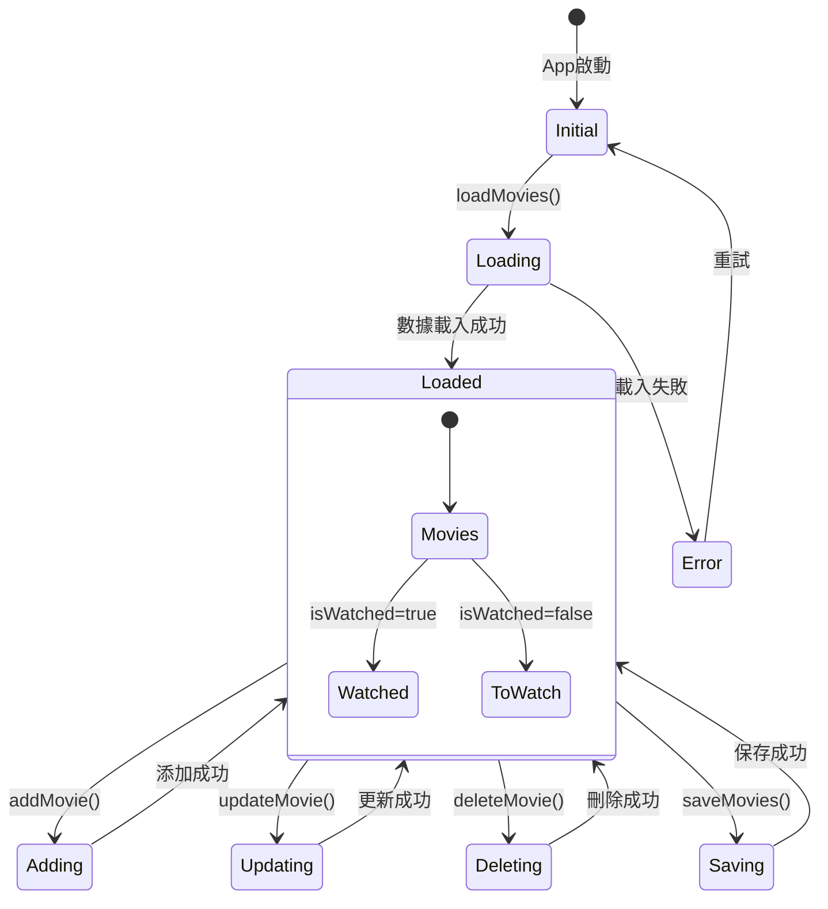
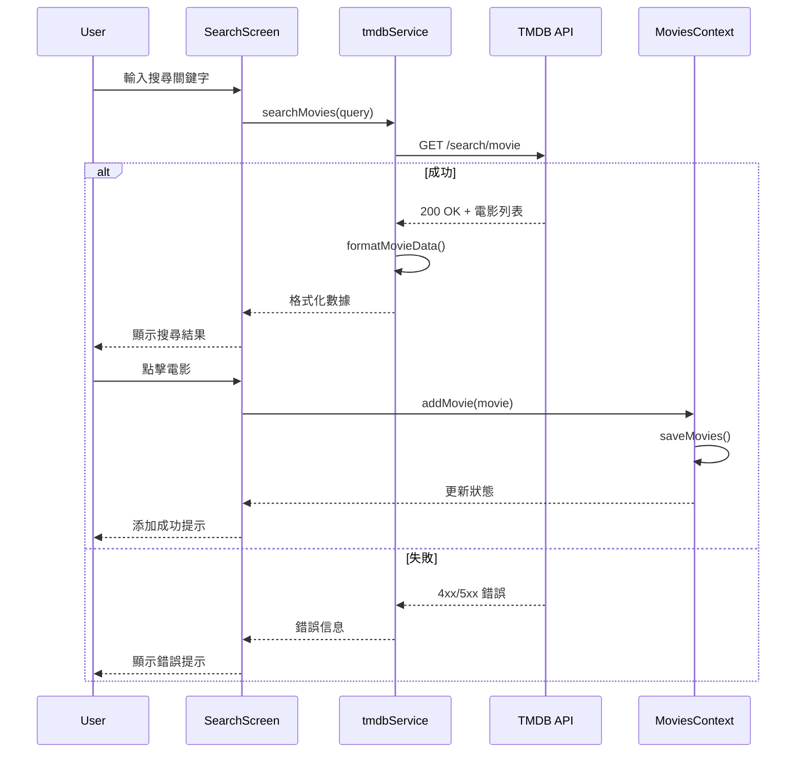
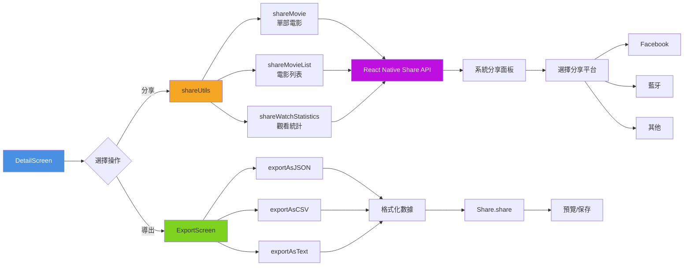
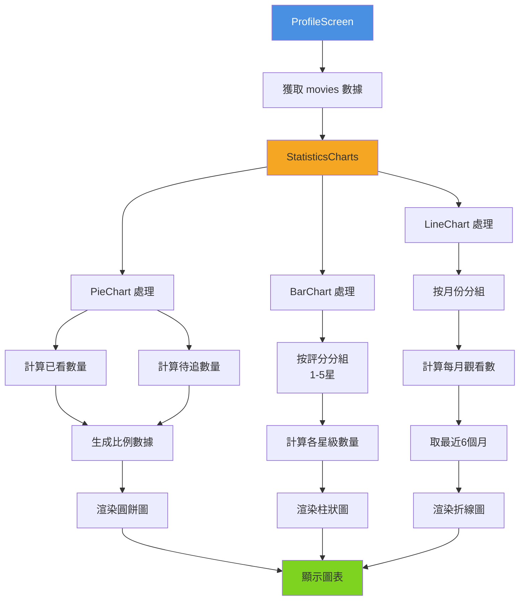

# 電影管理平台架構圖 (視覺化版本)

## 1. 整體系統架構圖

## 2. 功能模塊架構圖

## 3. 數據流向圖

## 4. 推薦系統流程圖

## 5. 導航結構圖

## 6. 組件層級結構圖

## 7. Context 狀態管理圖

## 8. TMDB API 集成流程圖

## 9. 分享與導出功能流程圖

## 10. 統計圖表數據處理流程

---

## 圖表說明

### 使用方式
這些圖表使用 **Mermaid** 語法繪製，可以在以下環境中查看：

1. **GitHub** - 直接在 GitHub 上查看此 MD 文件
2. **VS Code** - 安裝 `Markdown Preview Mermaid Support` 擴展
3. **線上工具** - [Mermaid Live Editor](https://mermaid.live/)

### 圖表類型
- 📊 **流程圖 (Flowchart)** - 展示業務邏輯流程
- 🔄 **序列圖 (Sequence Diagram)** - 展示組件間互動
- 🏗️ **圖表 (Graph)** - 展示架構關係
- 🔀 **狀態圖 (State Diagram)** - 展示狀態變化

---

**創建日期：** 2025年12月31日  
**版本：** 1.0.0
